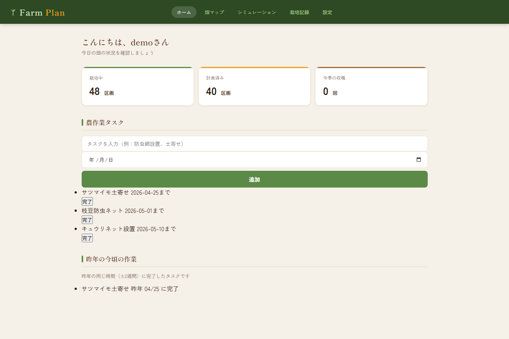
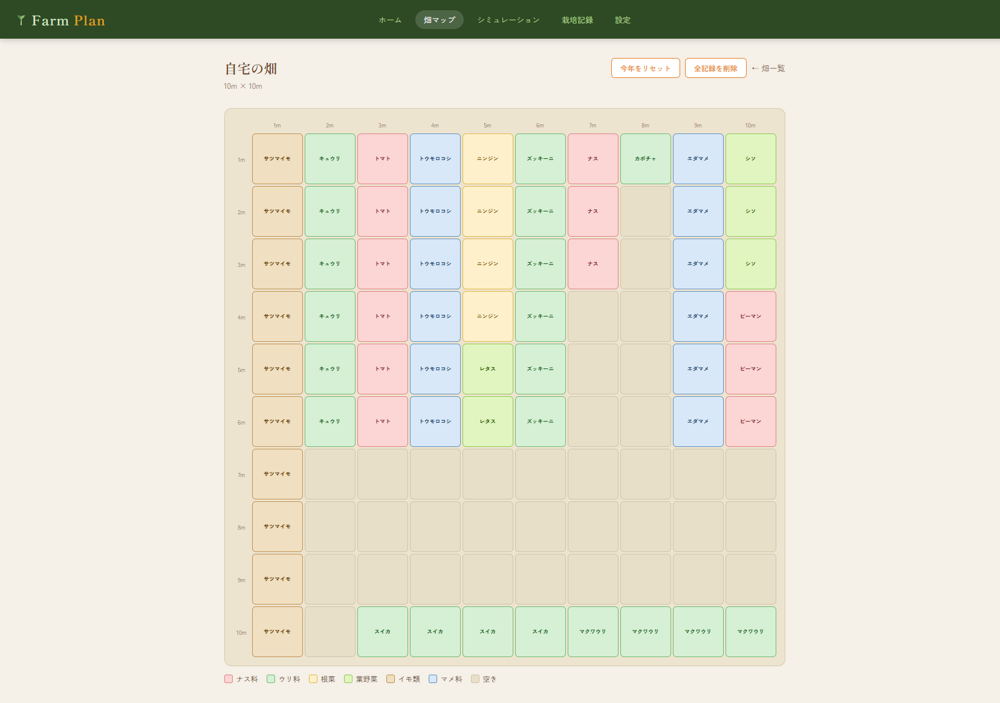
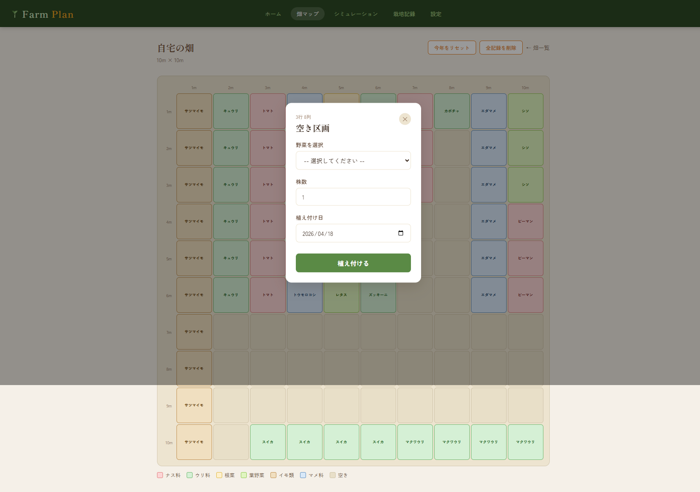
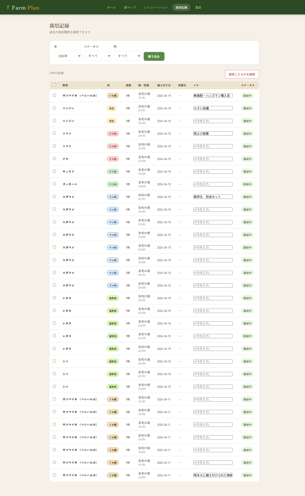
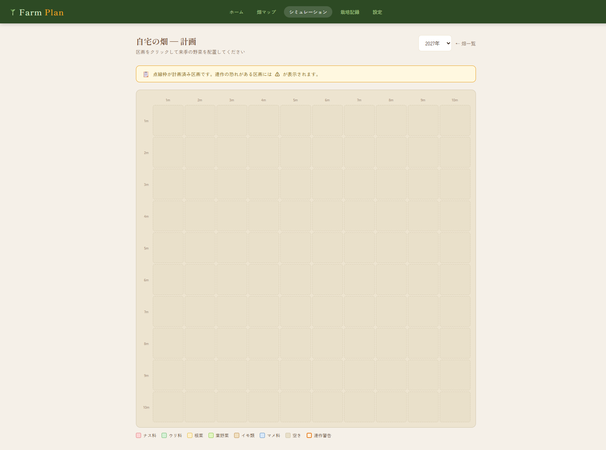

# 🌱 FarmPlan（作付けプランナー）

畑の区画をグリッドで可視化し、野菜の配置・連作障害チェック・来季のシミュレーションを支援するWebアプリです。

---

## デモ

🌱 **https://ayakomochi.xsrv.jp/farmplan/**

| ユーザー名 | メール | パスワード |
|---|---|---|
| demo | demo@example.com | demo1234 |

---

## ドキュメント

- [要件定義書](docs/requirements.md)

---

## 開発背景

大阪から宮崎に移住し農業に携わった経験から、作付け計画が「経験と勘」に依存していることを実感しました。データとロジックでその課題を解決したいと考え、FarmPlanを開発しました。

---

## 画面一覧

| 画面 | 説明 |
|---|---|
| ホーム | 栽培中・計画済み区画数、直近の栽培記録を表示 |
| 畑マップ | グリッドで畑を可視化。区画をクリックして野菜を登録・収穫 |
| シミュレーション | 来季の作付け計画を立てる。連作警告を事前に確認 |
| 栽培記録 | 年・ステータス・科で絞り込んで栽培履歴を確認・削除 |
| 設定 | プロフィール変更・パスワード変更・野菜マスタ管理 |

### ホーム


### 畑マップ


### 植え付けモーダル


### 栽培記録


### シミュレーション


---

## 主な機能

- **畑グリッド管理**：畑のサイズを自由に設定。1m²単位の区画を自動生成
- **科ごとの色分け表示**：ナス科・ウリ科・根菜など6科を色で視覚的に区別
- **連作障害チェック**：過去3年の栽培記録を参照し、同じ科の連続栽培を警告
- **株数管理**：1区画ごとに株数（1〜99株）を記録・表示
- **植え付け情報の編集**：登録後も株数・植え付け日をモーダルから変更可能
- **植え付けの取り消し**：誤登録時にレコードを削除して空き区画に戻せる
- **品種の選択肢表示**：野菜選択時に品種名を表示（例：トマト（大玉））
- **シミュレーション**：来季の計画を本番データとは別に管理（mode: plan/actual）
- **野菜マスタ管理**：ユーザーが独自の野菜を追加・削除可能
- **栽培記録の一括削除**：チェックボックスで複数記録を選択して削除
- **畑・記録の削除**：畑削除時はON DELETE CASCADEで関連データも連動削除
- **畑名の重複防止**：同一ユーザーが同名の畑を登録できないようPHP＋DB制約で制御

---

## 技術スタック

| 項目 | 技術 |
|---|---|
| フロントエンド | HTML / CSS / JavaScript |
| バックエンド | PHP 8.2 |
| データベース | MySQL 8.0 |
| 開発環境 | Docker / Docker Compose |
| フォント | Shippori Mincho / Zen Kaku Gothic New（Google Fonts） |

---

## セキュリティ対策

| 対策 | 実装内容 |
|---|---|
| パスワード暗号化 | `password_hash()` / `password_verify()` |
| SQLインジェクション対策 | PDOプリペアドステートメント |
| XSS対策 | `htmlspecialchars()` による出力エスケープ |
| セッション固定攻撃対策 | ログイン後に `session_regenerate_id()` を実行 |
| 認証ガード | 全ページでセッション確認、未ログインはリダイレクト |
| 所有権確認 | 他ユーザーのデータへのアクセスをDBレベルで制限 |
| 機密情報管理 | `.env` ファイルで管理、`.gitignore` で除外 |

---

## DB設計

```
users           ユーザー管理
fields          畑の管理（サイズ・名前）
plots           区画（1m²単位、fieldsに紐づく）
plot_seasons    栽培履歴（連作チェックの核心テーブル）
vegetables      野菜マスタ（科・品種）
companion_rules コンパニオンプランツルール
harvests        収穫記録
```

`plot_seasons` の `mode` カラム（plan / actual）で**シミュレーションと実績を同一テーブルで管理**しています。

---

## ローカル環境構築

```bash
git clone https://github.com/aya-k-o/farmplan.git
cd farmplan

# .envを作成
copy .env.example .env   # Windows
# cp .env.example .env   # Mac / Linux
```

作成された `.env` をテキストエディタで開き、パスワードを任意の文字列に設定してください：

```
DB_NAME=farmplan
DB_USER=farmplan_user
DB_PASS=任意のパスワード
DB_ROOT_PASS=任意のパスワード
```

```bash
# Dockerを起動
docker-compose up -d
```

起動後：
- アプリ：http://localhost:8080
- phpMyAdmin：http://localhost:8081

> ※ デモ環境は **https://ayakomochi.xsrv.jp/farmplan/** で公開中です。

---

## 今後の展望

- 区画の複数選択による一括植え付け
- コンパニオンプランツの相性表示
- 収穫量の統計グラフ表示

---

## 作者

香川 紋子  
[GitHub](https://github.com/aya-k-o/farmplan)
