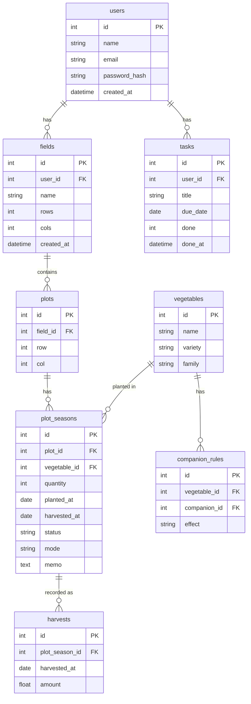

# ER図（データベース設計）

## テーブル構成



## 設計のポイント

### 1. マルチテナント設計
`users`テーブルでユーザー単位のアカウントを管理。`fields`テーブルに`user_id`を持たせることで、複数ユーザーが同じアプリを安全に使用できます。

所有権確認により、URL直打ちによる他ユーザーのデータへのアクセスを防止しています。

```sql
-- 自分の畑だけ取得
SELECT id, name FROM fields 
WHERE user_id = ?
```

### 2. 畑とグリッドの分離
- `fields`：畑全体のメタデータ（サイズ・名前）
- `plots`：1m²単位の区画（row, col）

畑削除時は **ON DELETE CASCADE** で `plots` → `plot_seasons` も連動削除されます。

### 3. 計画と実績の同一テーブル管理
`plot_seasons.mode` カラムで計画（plan）と実績（actual）を区別。

- `mode = 'plan'`：シミュレーション画面で管理
- `mode = 'actual'`：畑マップ画面で管理

同一テーブルで扱うことで、計画を実績に移行する処理がシンプルになります。

### 4. ステータス管理
`plot_seasons.status` カラムで栽培の状態を管理。

| ステータス | 意味 | 移行条件 |
|---|---|---|
| `planned` | 計画済み | シミュレーションで配置 |
| `growing` | 栽培中 | 畑マップで植え付け |
| `harvested` | 収穫済み | 「収穫した」ボタン押下 |
| `failed` | 失敗 | 「失敗した」ボタン押下 |

### 5. 連作障害チェックの仕組み
`plot_seasons` に過去3年分のデータを保持。同一区画（plot_id）で過去に栽培された野菜の科（family）をAJAXでチェックします。

```sql
-- 過去3年の同科栽培を確認
SELECT COUNT(*) FROM plot_seasons ps
JOIN vegetables v ON ps.vegetable_id = v.id
WHERE ps.plot_id = ? 
  AND v.family = ?
  AND ps.planted_at >= DATE_SUB(CURDATE(), INTERVAL 3 YEAR)
```

### 6. 外部キー制約
- `fields(user_id, name)` に **UNIQUE制約**（畑名の重複防止）
- `plots(field_id)` → `fields(id)` **ON DELETE CASCADE**
- `plot_seasons(plot_id)` → `plots(id)` **ON DELETE CASCADE**
- `plot_seasons(vegetable_id)` → `vegetables(id)`（削除時はエラー）

### 7. タスク管理
`tasks` テーブルで農作業タスクを管理。

- `done = 0`：未完了
- `done = 1`：完了済み（done_at に完了日時を記録）

完了日時を記録することで、「昨年の今頃の作業」を参照できます。

```sql
-- 昨年の今頃の完了タスク（±14日）
SELECT * FROM tasks
WHERE user_id = ?
  AND done = 1
  AND DATE_FORMAT(done_at, '%m-%d') 
      BETWEEN DATE_FORMAT(DATE_SUB(NOW(), INTERVAL 1 YEAR) - INTERVAL 14 DAY, '%m-%d')
      AND DATE_FORMAT(DATE_SUB(NOW(), INTERVAL 1 YEAR) + INTERVAL 14 DAY, '%m-%d')
```